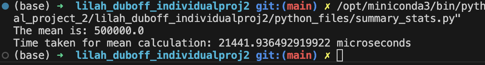
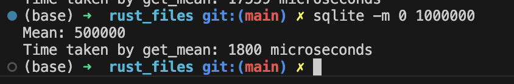

# Individual Project 2/Mini Project 8: Rewriting a CRUD Operations Python Script in Rust
---
##### The purpose of this project is to take an existing python project, convert it to Rust, and compare the speed and efficiency of both scripts. This projects demonstrates how to perform CRUD operations in both Rust and Python, using a CLI (Command Line Integration) Tool. As usual, the folder structure and project walkthrough are below - however, I've decided to show my analysis results at the top of the readme for convenience, and directions for setup and use of the CLI tools are below.  
---
### Use of Codeium LLM for project assistance
##### To help me complete the project, I utilized Codeium - which functions similar to GitHub Copilot. I found that I was lacking domain knowledge about Rust syntax, but could get a broad understanding of how the functions and project layout were structured from reading the project template. To help understand specifics, I input code segments and errors into Codeium, and asked it to explain the details to me. While I did use it to debug my code, I actually came to appreciate the way Rust structures the error messages. Any error messages that popped up explicitly stated what the problem was and how to resolve it - I found this to be a really helpful and interesting feature. I also asked it to generate tests that differed in complexity, in order to gain a better understanding of how to write the lib test functions. 
---
### Demo Video Link:

___
### Rust vs Python - which is faster?
##### In addition to rewriting the python script, this project also provides a comparison of Rust and Python's speed and resource usage advantages and disadvantages. Rust is a compiled (or binary deployement) language, meaning that the code compiles into a single executable file. This method is faster and more efficient for users, but has limited flexibility, as binaries are platform-specific. 

##### In comparison, python is slower, but more user friendly. Packaging deployment is common in Python, and involves distributing code as packages. These packages require an interpreter (Python) to run. Unlike Rust, this method is not platform-specific, but is much slower for a couple of reasons, including having to manage more dependencies.

##### To see a direct comparison of the speeds of python and Rust, I wrote functions to sum and calculate the mean of a range of numbers 1-1000000, in both languages. Here are the results:

#### **Python Mean**

#### **Rust Mean**

##### We can see that calculating the mean in python took approximately 21442 microseconds, while Rust took 1800 microseconds. The Rust calculations were almost 12 times faster than the python calculations. I ran it a couple of times to be sure that these were reliable values, and found that the speed of the python script ranged between 18,000-22,000 microseconds, while Rust ranged from around 1800-2500 microseconds. 
---
---
### Structure for this Project
---
- .devcontainer
    - devcontainer.json
    - Dockerfile
- .github
    - python_actions.yml
    - rust_actions.yml
- data
    - test_data.csv
    - wages_by_education.csv
- python_files
    - extract.py
    - query.py
    - summary_stats.py
    - transform.py
- readme_screenshots (.png files used in readme)
- rust_files
    - src
        - lib.rs
        - main.rs
    - Cargo.lock
    - Cargo.toml
    - Makefile
    - my_database.db
- test_python_files
    - test_extract.py
    - test_query.py
    - test_transform.py
- main.py
- Makefile
- my_database.db
- README
- requirements.txt

---
### How to Install Rust CLI Dependencies
---
##### *Note: This project assumes that a Rust environment is already set up.*
##### To begin, we will need clap, rusqlite, and csv for dependencies. This can be set up by running the followign commands in the terminal:
- [x] cargo add clap --features derive
- [x] cargo add rusqlite
- [x] cargo add csv

##### After running these commands, they will appear in the Cargo.toml file. 
---
### Workflow Structure
##### Each time a change is made to the code, it will need to be saved and compiled, in order for the program to update itself. This can be done by running:
- [x] Cargo check
- [x] Cargo build
- [x] Cargo build --release
    - This cargo build --release command generates a binary file within the project/target/release folder. This file ultimately is what gets returned as a binary artifact when running the GitHub actions.

---
### CLI Functionality and Directions for Use
##### The main.rs file calls a series of functions in the lib.rs file - these functions follow the standard SQL format of CRUD (Create, Read, Update, and Delete) functions. At the top of the main function, a series of flags are defined for easy integration into the terminal, shown here:

##### However, before the flags are able to be used, the path to our project's release folder must be established/updated. In VSCode, this can be done by running:
    export PATH=$PATH:/Users/<yourusername>/<Path to Project on Local Machine>/<Your Repo Name>/<Your Project Name/target/release

##### On my local machine, it looks like this:
    export PATH=$PATH:/Users/lilahduboff/Documents/Duke\ DES\ Coursework/individual_project_2/lilah_duboff_individualproj2/rust_files/target/release

##### After running that command in the terminal, the flags can now be used. By running the help command, a list of available functions/flags will appear in the terminal, as shown in the image above. These flags allow the user to complete standard CRUD operations from the terminal, so long as the data/schema are updated accordingly.
---
### The Data and Goal for this Example
##### The data being used in this example is a free kaggle dataset containing information about the average hourly wage for different levels of education, and then separated by demographics. For simplicity, this project simply compares the overall average wage of different education levels, over a period of roughly 50 years.

##### The Create function makes a connection to a local database (my_database.db), and generates a table, with a name that the user inputs with the -c flag. Similarly, using the -d flag will delete the table from the database. To load data into the table, the -l flag is used, along with two parameters: the table name used for -c, and the relative file path. Finally, the update function is called with -u, and provides a way to update specific values of the wages, based on the year given. The update function can be adjusted or expanded based on the user's needs.

##### Added into the flags is -m, for calculating the mean of two integers. It can be used by typing <your_project_name> -m <integer_1> <integer_2> into the terminal. A sample command would look like this:

<sqlite -m 3 600>

---
### Screenshots of the CLI in action:
---
#### **CREATE**

---
#### **LOAD**

---
#### **UPDATE**

---
#### **DELETE**

---
