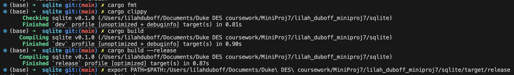
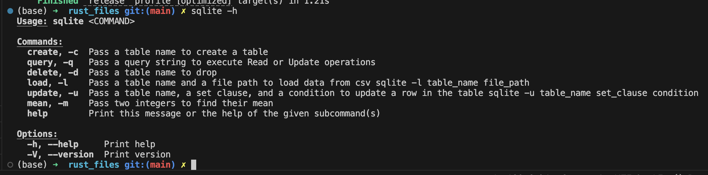
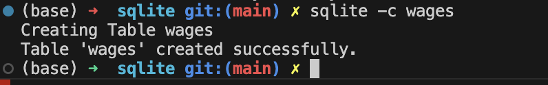
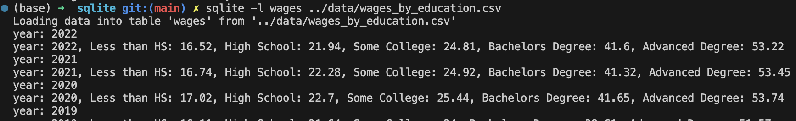
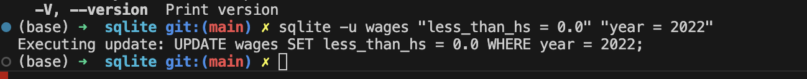
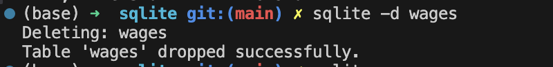
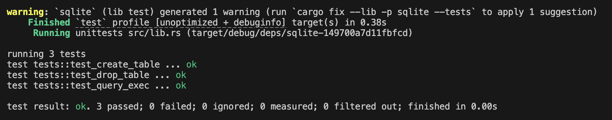

# Mini Project 7: Functional Command Line Tool with Rust
#### Unlike the previous projects, this ReadMe provides instructions for setup and use 
---

### Structure for this Project
---
- .devcontainer
    - devcontainer.json
    - Dockerfile
- .github
    - CI.yml
- add (ignore, this is a generated folder)
- data
    - wages_by_education.csv (data for the CRUD operations)
- sqlite (main project folder)
    - src
        - lib.rs
        - main.rs
    - Cargo.lock
    - Cargo.toml
    - Makefile
- README
- readme_screenshots folder
---
### How to Install Rust CLI Dependencies
---
##### *Note: This project assumes that a Rust environment is already set up.*
##### To begin, we will need clap, rusqlite, and csv for dependencies. This can be set up by running the followign commands in the terminal:
- [x] cargo add clap --features derive
- [x] cargo add rusqlite
- [x] cargo add csv

##### After running these commands, they will appear in the Cargo.toml file. 
---
### Workflow Structure
##### Each time a change is made to the code, it will need to be saved and compiled, inorder for the program to update itself. This can be done by running:
- [x] Cargo check
- [x] Cargo build
- [x] Cargo build --release
    - This cargo build --release command generates a binary file within the project/target/release folder. This file ultimately is what gets returned as a binary artifact when running the GitHub actions.

---
### CLI Functionality and Directions for Use
##### The main.rs file calls a series of functions in the lib.rs file - these functions follow the standard SQL format of CRUD (Create, Read, Update, and Delete) functions. At the top of the main function, a series of flags are defined for easy integration into the terminal, shown here:

##### However, before the flags are able to be used, the path to our project's release folder must be established/updated. In VSCode, this can be done by running:
    export PATH=$PATH:/Users/<yourusername>/<Path to Project on Local Machine>/<Your Repo Name>/<Your Project Name/target/release

##### On my local machine, it looks like this:
    export PATH=$PATH:/Users/lilahduboff/Documents/MiniProj7/lilah_duboff_miniproj7/sqlite/target/release

##### After running that command in the terminal, the flags can now be used. By running the help command, a list of available functions/flags will appear in the terminal, as shown in the image above. These flags allow the user to complete standard CRUD operations from the terminal, so long as the data/schema are updated accordingly.
---
### The Data and Goal for this Example
#####    The data being used in this example is a free kaggle dataset containing information about the average hourly wage for different levels of education, and then separated by demographics. For simplicity, this project simply compares the overall average wage of different education levels, over a period of roughly 50 years.
#####   The Create function makes a connection to a local database (my_database.db), and generates a table, with a name that the user inputs with the -c flag. Similarly, using the -d flag will delete the table from the database. To load data into the table, the -l flag is used, along with two parameters: the table name used for -c, and the relative file path. Finally, the update function is called with -u, and provides a way to update specific values of the wages, based on the year given. The update function can be adjusted or expanded based on the user's needs.
#### **CREATE**

---
#### **LOAD**

---
#### **UPDATE**

---
#### **DELETE**

---
### Tests
##### As I am still naviagting Rust as a language, I've made three simple test functions to ensure that the project is able to create and connect to a database, generate a table, and drop a table. These tests all passed, and I will work on incorporating further testing as I become accustomed to working in Rust
